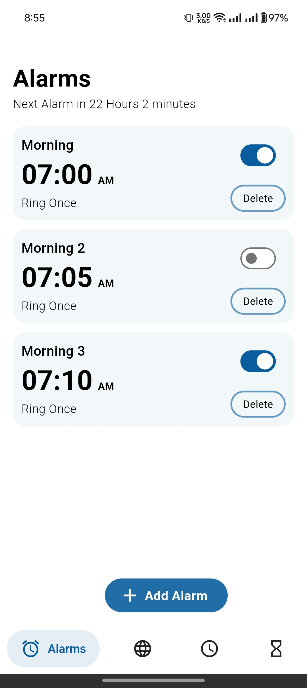
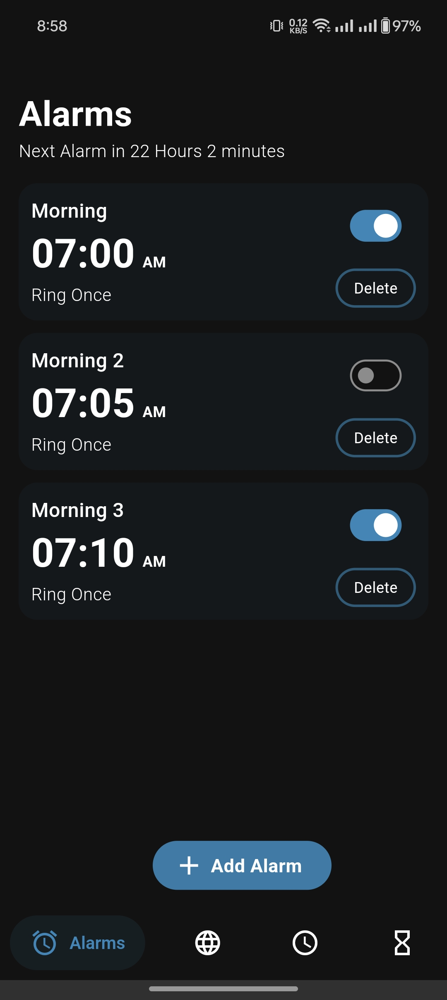
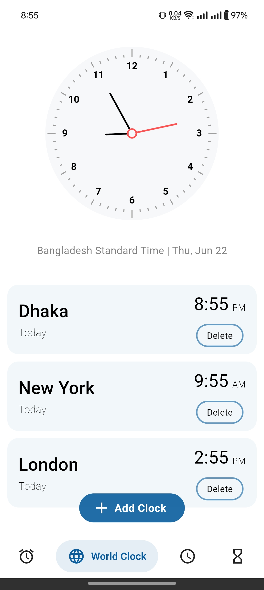
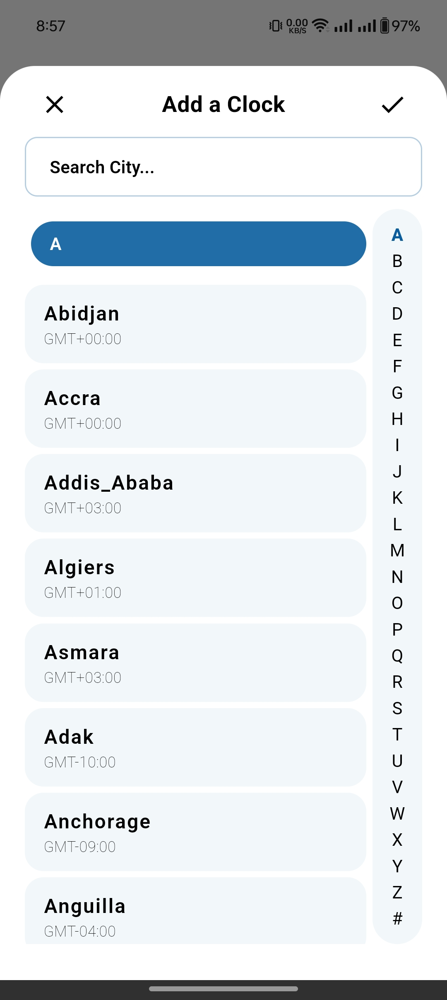
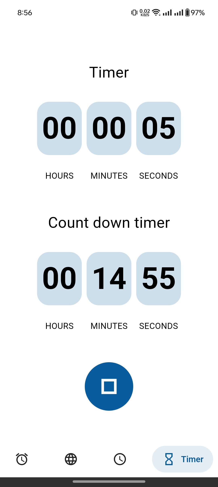
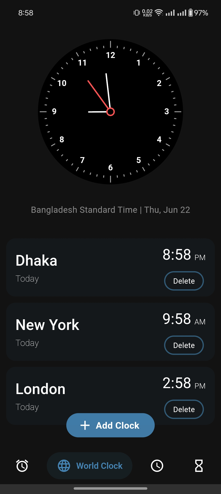
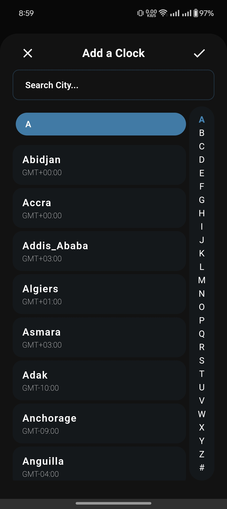
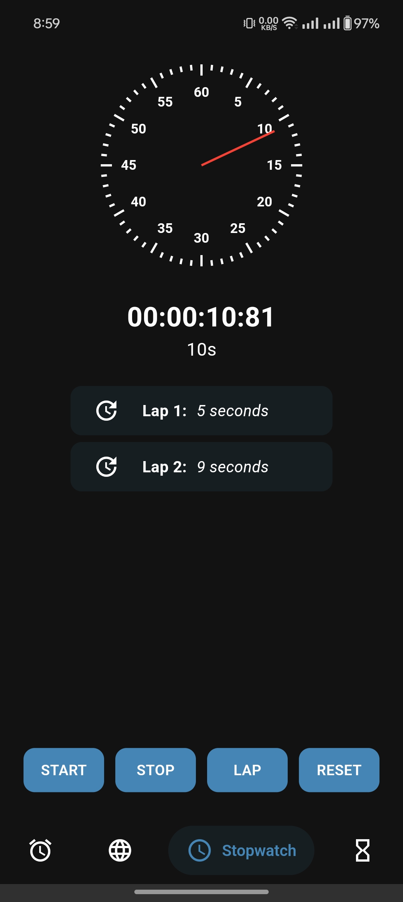
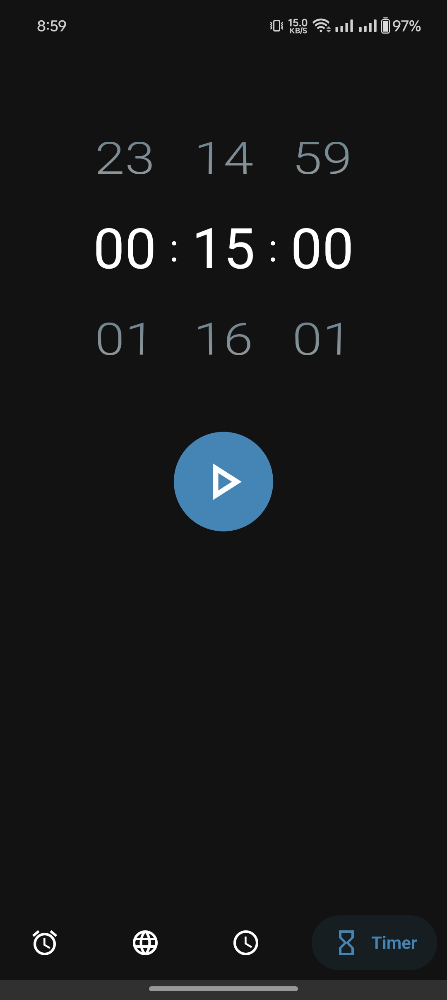
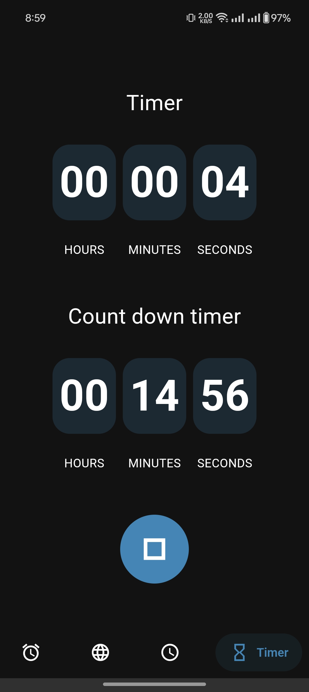

# Better Clock

Better Clock is a Flutter app designed as an improved version of the default Android Clock app. It includes core features like setting Alarms, World Clock, Stopwatch, and Timer, aiming to provide a seamless and enhanced user experience.

## Features

- **Alarms**: Set alarms with customizable times. *(Note: Multi-day alarm setting is currently under improvement for consistent functionality.)*
- **World Clock**: Add, view, and update clocks for multiple time zones around the world.
- **Stopwatch**: Track time accurately with a stopwatch feature, including lap times.
- **Timer**: Set timers for any duration with a clean, easy-to-use interface.

## Screenshots

### Light Theme

### Dark Theme

