# Better Clock

Better Clock is a Flutter app designed as an improved version of the default Android Clock app. It includes core features like setting Alarms, World Clock, Stopwatch, and Timer, aiming to provide a seamless and enhanced user experience.

  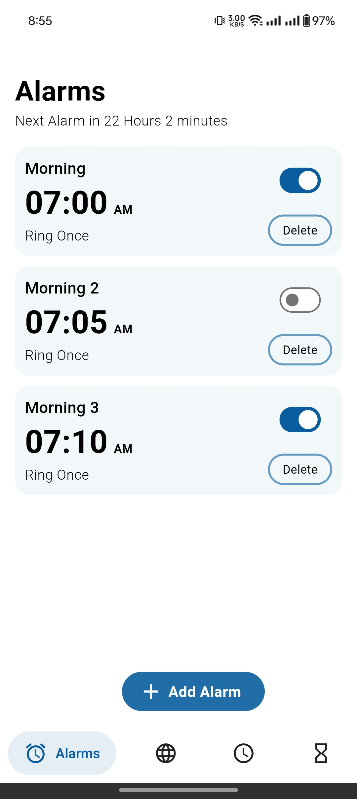
  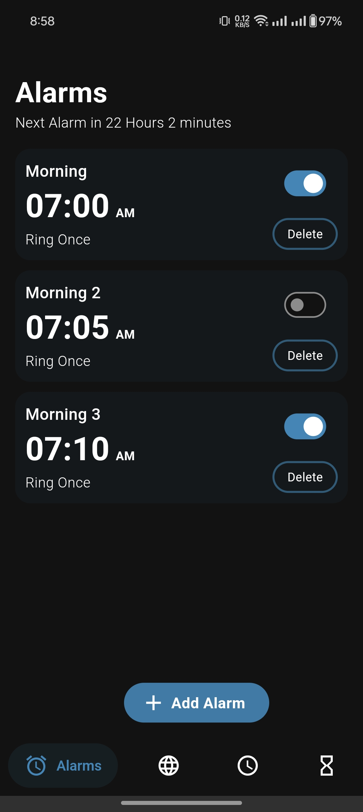

## Features

- **Alarms**: Set alarms for specific times, with future support for multi-day scheduling.
- **World Clock**: Add and update clocks for different time zones.
- **Stopwatch**: Track time with precision, start, stop, and reset.
- **Timer**: Set timers with ease for a variety of time intervals.
- **Light & Dark Themes**: Choose between light and dark modes for better usability based on preference or environment.

## Screenshots

  
  

  
  

  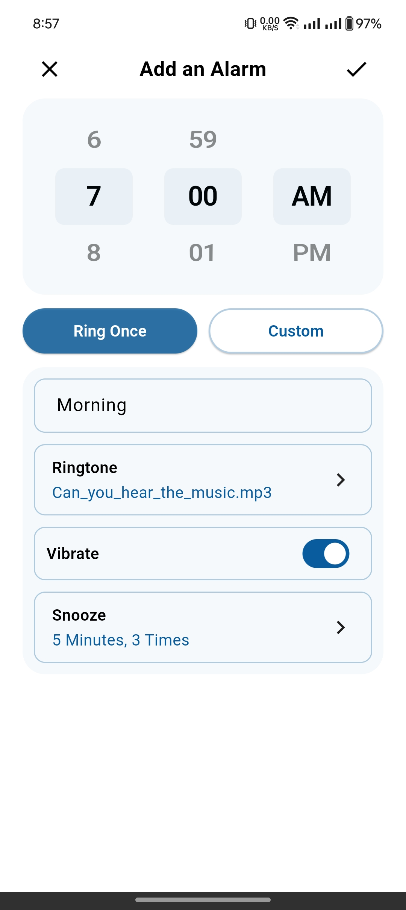
  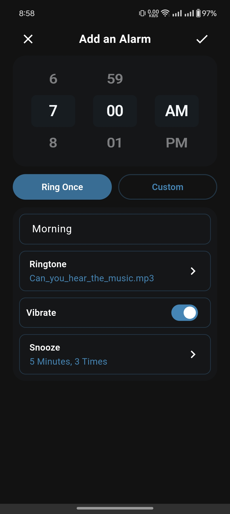

  
  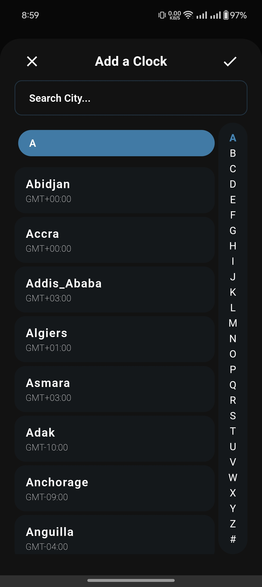

  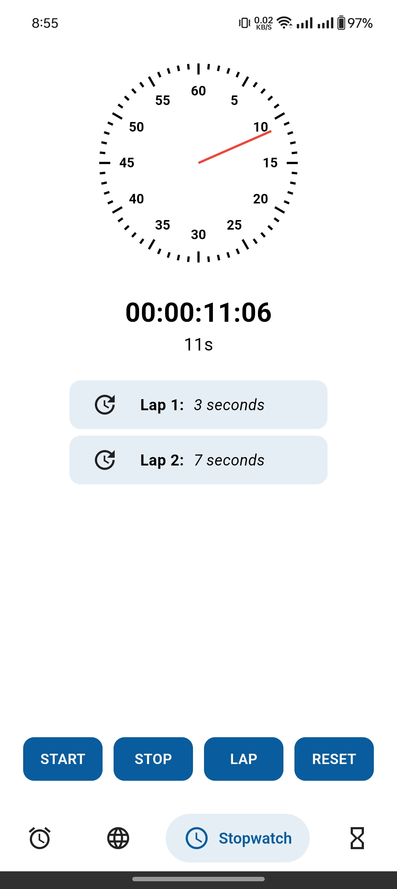
  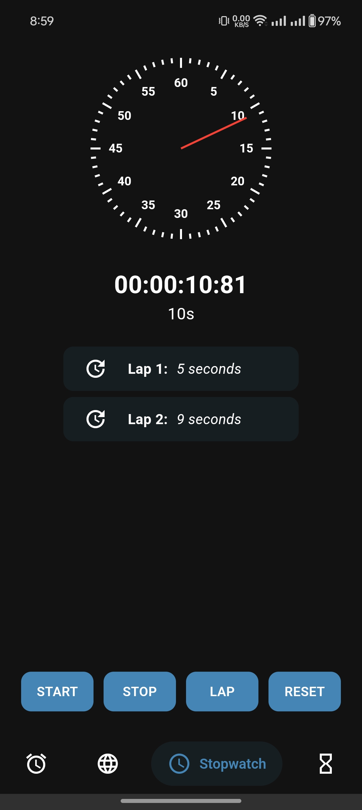

  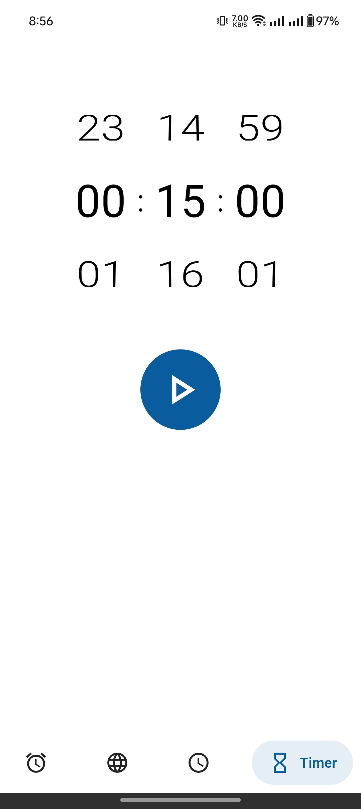
  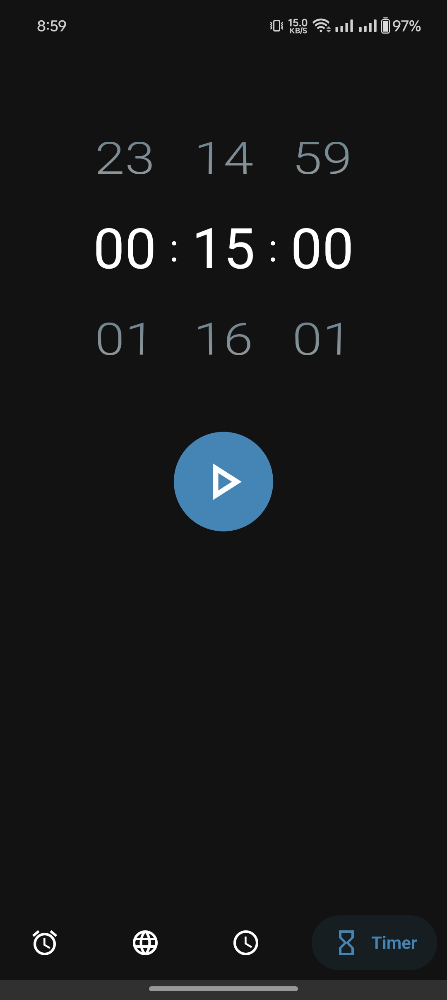

  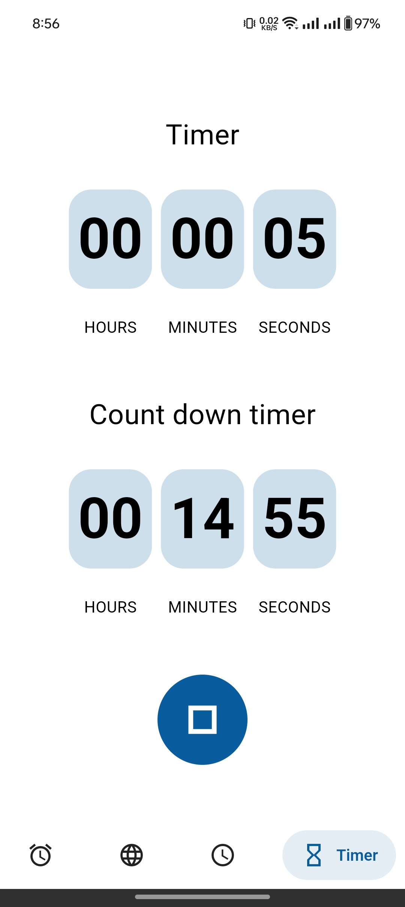
  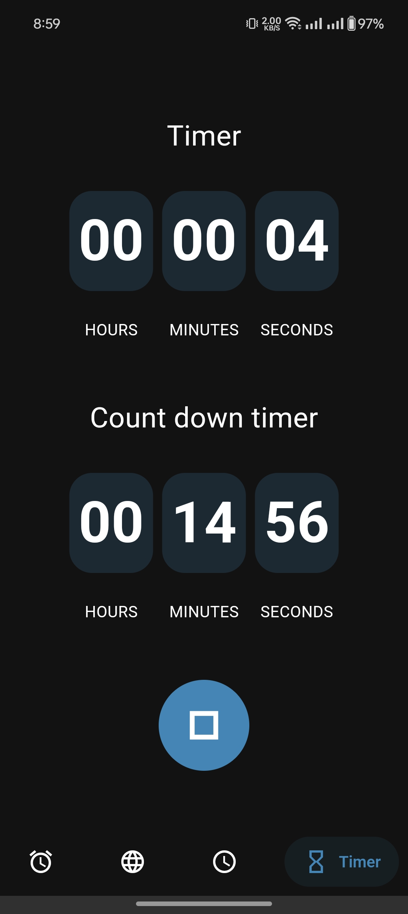

